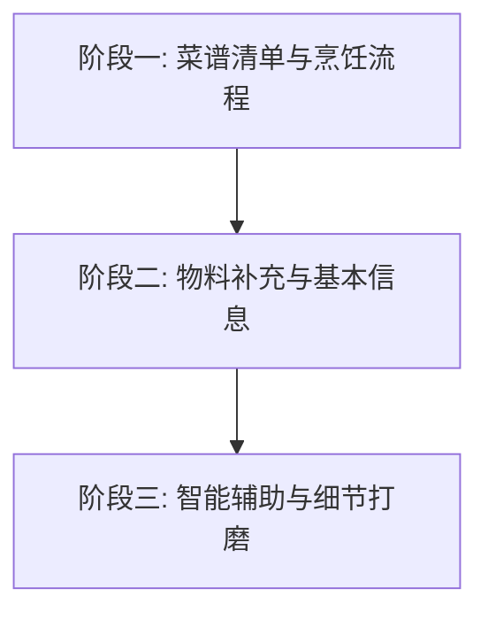

# 个人菜谱管理系统 - 项目目标与规划 (Project Goals & Roadmap)

本项目旨在打造一个视觉精美、交互流畅的个人离线菜谱与厨房物料管理系统。以下是当前已规划的核心目标与阶段性开发路径。

---

## 📌 核心阶段规划 (Core Phasing)

---

## 🍽️ 阶段一：菜谱清单与烹饪流程 (Recipe List & Cooking Flow)
*当前状态：核心逻辑已就绪，等待交互与细节的进一步补充*

此模块的核心是帮助用户快速浏览、查找菜谱，并在进入烹饪状态时提供清晰的准备步骤和烹饪流程指导。

### 1. 菜谱列表展示 (Recipe List Feed)
*   **流式卡片布局**：采用符合 Atlassian 设计系统风格的卡片式布局，展示菜谱封面、难度级别、准备时间、烹饪时间和口味标签。
*   **多维检索与过滤**：支持按照早餐/午餐/晚餐分类进行过滤，以及支持基于菜名、食材和厨师关键字的实时检索。
*   **未来细节补充**：
    *   [ ] 菜谱评分与历史烹饪次数统计
    *   [ ] 图片自定义上传/拍摄预览

### 2. 菜谱详情与分步流程 (Recipe Detail & Active Cook Session)
*   **准备清单 (需准备的)**：点击菜谱卡片进入详情，首选展示完整的食材与调味品配比清单。支持复选框确认（Checked），便于下锅前清点。
*   **分步烹饪流程 (烹饪流程)**：
    *   采用清晰的步骤卡片和序号指引，聚焦当前步骤。
    *   针对耗时步骤集成分步倒计时器（Beep 蜂鸣警报与桌面系统级通知），防止烹饪过程中烧干或超时。
*   **未来细节补充**：
    *   [ ] 烹饪小贴士（Tips）展开与收起
    *   [ ] 分份量智能折算（如选择 1人份 / 2人份 / 4人份，食材用量自动按比例缩放）

---

## 📦 阶段二：物料补充与基本信息 (Materials & Replenishment)
*当前状态：物料分类框架已构建，待强化基础信息维护与补充操作*

此模块旨在帮助用户管理厨房资产（食材、调料、香料的库存与采购）。

### 1. 物料基本信息管理 (Ingredient Metadata)
*   **细分物料品类**：
    *   **基础食材**：蔬菜、肉类、蛋类等核心生鲜。
    *   **调味酱料**：油、盐、酱、醋、豆瓣酱等常备调味品。
    *   **香料**：葱、姜、蒜、花椒、八角等干货与提味辅料。
*   **未来细节补充**：
    *   [ ] 补充**物料保质期**（Expiration Date）与过期自动提醒。
    *   [ ] 补充**规格与参考单位**（量化单位，如 瓶/克/袋）。
    *   [ ] 补充**存放地点**标记（如 冷冻室/冷藏室/常温避光）。

### 2. 物料状态与补充机制 (Stock Replenishment Flow)
*   **库存状态智能比对**：
    *   当进入菜谱详情时，系统会自动将菜谱所需食材与用户现存的“现有食材”进行模糊匹配。
    *   缺少的食材状态自动标为 **“需采购”**，已有的标为 **“有库存”**。
*   **物料补充入口 ( replenishment )**：
    *   在“常用食材”页面中，支持一键切换物料状态，或一键设为“有库存”/“需采购”。
    *   在“现有食材”面板中，用户可以快速删除已消耗的食材，或点击“添加食材”从物料库中勾选补充。
*   **未来细节补充**：
    *   [ ] **智能采购清单**：支持一键生成需补货的物料清单，并支持导出或复制为纯文本发给微信或购物软件。
    *   [ ] **库存下限预警**：当调料或常备食材低于设定阈值时，自动归入待补充状态。

---

## 🚀 阶段三：系统高级特性 (System Advanced Features)
*   **IndexedDB 离线持久化**：保证大容量离线存储，数据永不丢失。
    *   [x] 启动防抖与数据屏障
    *   [x] 历史存量数据从 localStorage 安全迁移
*   **数据导入/导出**：
    *   [x] 导出的备份 JSON 带有版本戳
    *   [x] 导入时执行 `DATA_MIGRATIONS` 版本链平滑迁移，避免由于后续字段更新导致旧数据报废。
*   **Atlassian 视觉风格**：
    *   [x] 原生支持 Light/Dark 暗黑模式切换
    *   [x] 极简且专业的紧凑型操作布局

---
*此目标与规划将根据您的后续意见进行动态调整和细化。*
